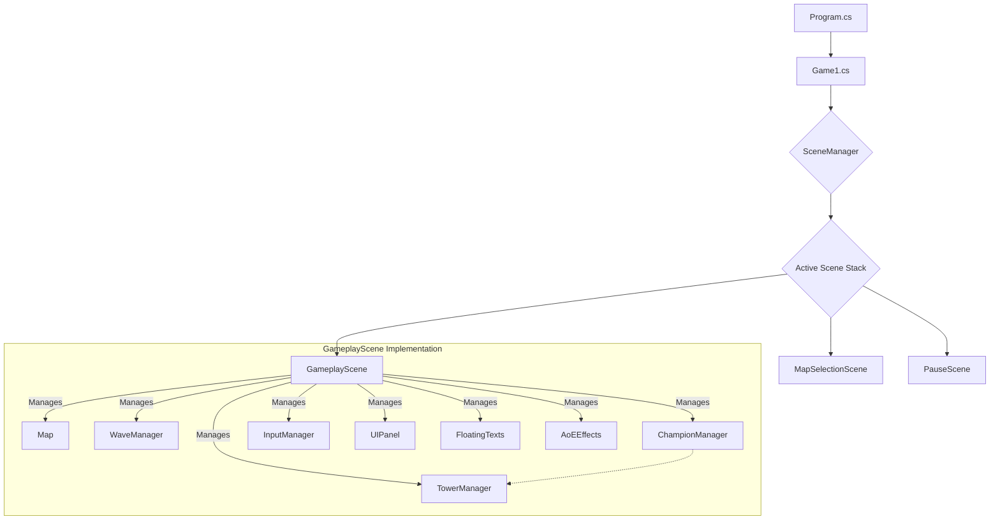

# Architecture Map

## Core Class Relationships

## Scene Management

- **Scene Stack**: `SceneManager` uses a stack-based system.
  - `SetScene()` replaces the entire stack (full scene transitions like MainMenu → Gameplay).
  - `PushScene()` adds an overlay (modal dialogs like pause menu).
  - `PopScene()` removes the top scene (resume underlying scene).
- Only the top scene updates and draws each frame.

## Data Flow

- **Down**: Scene passes data to managers via `Update()` args (e.g. enemies list).
- **Up**: Managers notify Scene via `Action<T>` callbacks.
- **Strict Isolation**: Managers never reference each other directly.
- **Rendering**: `SpriteBatch` and fonts passed down through `Draw()` calls.

## Key Non-Obvious Patterns

- **Towers as overlays**: `Tile.OccupyingTower` holds a Tower reference; underlying `TileType` never changes after init. Movement cost checks the tower first, then terrain.
- **Tower Types**: Enum-based with separate Generic (Gun, Cannon) and Champion (ChampionGun, ChampionCannon) variants. Each tower's stats live in a dedicated file under `Entities/Towers/` (e.g., `GunTower.cs`). `TowerData.GetStats()` is the registry that maps enum → stats. Map between variants with `TowerType.GetChampionVariant()` / `GetGenericVariant()` extension methods.
- **Tile Types**: Enum-based (HighGround, Path, Rock). Each tile type's stats (MovementCost, Color, IsBuildable) live in a dedicated file under `Engine/TileTypes/` (e.g., `HighGroundTile.cs`). `TileData.GetStats()` is the registry that maps enum → stats.
- **Champion Placement Rules** (via `ChampionManager`):
  - Only one Champion per type can be alive on map
  - Global 10s cooldown blocks all Champion placements after any Champion is placed
  - Individual 15s respawn cooldown per Champion type after death
  - Generic towers can ONLY be placed if their Champion variant is alive
  - Champion death triggers `Tower.UpdateChampionStatus(false)` on matching Generic towers
- **DrawScale**: All towers have `Vector2 DrawScale` (Generics: {1.0, 1.0}, Champions: {1.0, 1.5}). Champions use bottom-center origin (0.5, 1.0) and Y offset to grow upward while sitting on tile. Health/capacity bars use `SpriteSize * DrawScale.Y` for Y positioning.
- **Tower.Draw()**: Uses conditional origin selection based on `DrawScale.Y > 1.0f`. Champions offset Y position by `SpriteSize / 2f` so their bottom aligns with generic tower baseline.
- **TextureManager.DrawSprite()**: Extended with optional `origin` parameter (defaults to centered 0.5, 0.5) for flexible sprite anchoring.
- **ChampionManager Public API** (for UI): `GlobalCooldownRemaining` (property), `GetRespawnCooldown(type)`, `IsChampionAlive(type)`. Enables UI state determination without exposing private cooldown dictionaries.
- **UIPanel Integration**:
  - Queries `ChampionManager` to determine button states (can place, on cooldown, alive)
  - Generic tower buttons show "Champion Dead" overlay only if respawn cooldown is active (distinct from "never placed" state)
  - Champion buttons display "Limit Reached" (alive), "Global: X.Xs", or "Respawn: X.Xs" as cooldown text
  - `DrawGenericTowerButton()` helper reduces duplication of champion death logic
- **Debuff Hook**: `Tower.UpdateChampionStatus(bool isChampionAlive)` is virtual for implementing stat debuffs when Champions die.
- **AoE callback chain**: `Projectile.OnAOEImpact` → `Tower` → `TowerManager` → `GameplayScene` spawns the visual effect.
- **WaveManager** takes `Func<List<Point>>` so each spawned enemy gets the latest path.
